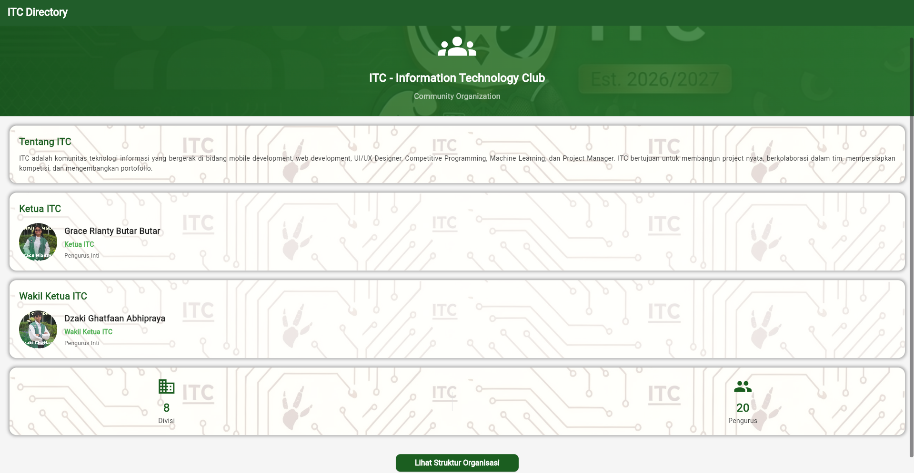
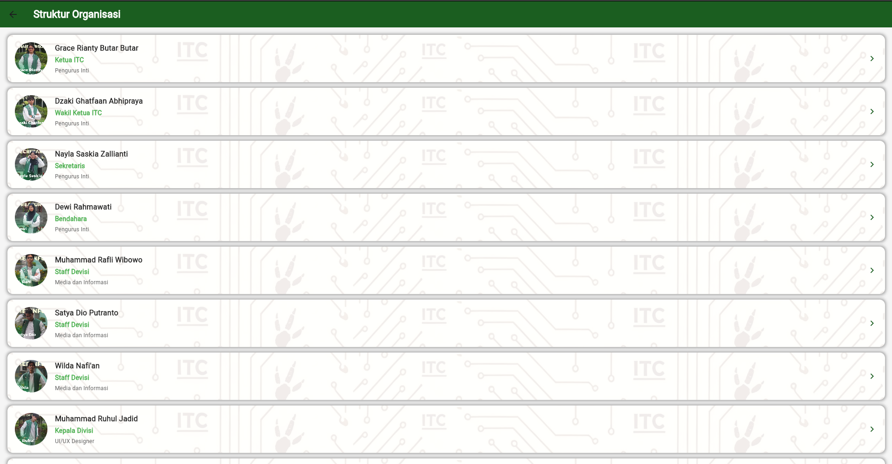
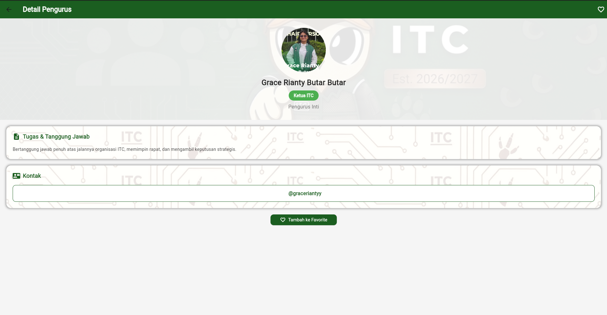

# ITC Directory - Information Technology Club

Aplikasi mobile Flutter untuk menampilkan struktur organisasi ITC (Information Technology Club).

## Fitur Aplikasi

- Menampilkan daftar pengurus ITC
- Detail informasi setiap pengurus
- Deskripsi tugas dan tanggung jawab
- Link Instagram pengurus
- Fitur favorite pengurus
- UI/UX yang menarik dengan tema hijau

## 📸 Screenshot Aplikasi

### Halaman Home


### Halaman Struktur Organisasi


### Halaman Detail Pengurus


## Cara Menjalankan Aplikasi

1. **Clone repository**
   ```bash
   git clone https://github.com/nadhirrifqi/itc-the-seeker-2026-Nadhir_Rifqi.git
2. **flutter pub get**
3. **flutter run**
